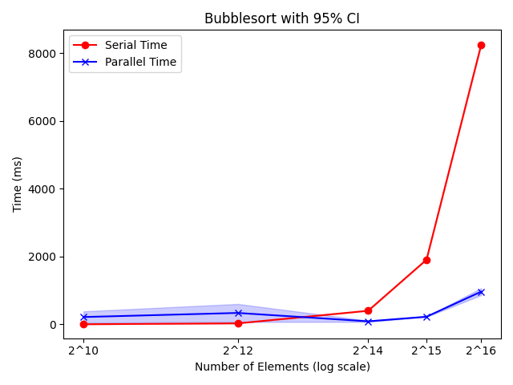
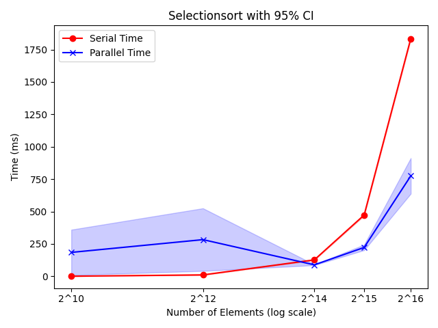

# Serial and Parallel Sorting Visualizer

This is the final project for Unicamp MC970 course, done by Felipe Brabes, Gabriela Jacob and Renan Florencio. It is based on [Dipesh Mann's implementation of Sorting Visualizer](https://github.com/dipesh-m/Sorting-Visualizer), with some changes described below.

**The full report in PDF is available in the repository on the `report.pdf` file.**

The original code done by Dipesh Mann is a sorting algorithms visualizer, which provided a visualization of different sorting algorithms in C++ with SDL2 Library. The code originally implemented the following sorting algorithms:

- Selection Sort
- Insertion Sort
- Bubble Sort
- Merge Sort
- Quick Sort
- Heap Sort

The main changes we did to this code was:

- Optimize by implementing parallel versions of the sorting algorithms already implemented
- Implement the logic for the parallel algorithms visualization
- Implement a different sorting algorithm (Bitonic Sort) and its parallel version
- Implement an automated runner, which benchmarks all of the algorithms implemented and returns a table with running times for each of the algorithms, comparing the parallel and serial versions

## How to run Sorting Visualizer

To run the Visualizer, you need to do the following:

1. Install SDL2

On Debian or Ubuntu, you can do it using the following command:
```
sudo apt install libsdl2-dev
```
2. Run the following command:
```
g++ Sorting\ Visualizer.cpp -w -lSDL2 -o visualizer -fopenmp
./visualizer
```
3. Follow the instructions of the Sorting Visualizer printed on the terminal: press ENTER twice to start the visualizer, and, once it starts, press the commands shown to run the desired sorting algorithm, to generate a new list or to quit the visualizer. To close the program, quit the visualizer and then write '-1' and press ENTER.

## How to run runner.py

The runner takes some time to finish, and the benchmarks are already in the next section of this README. However, if you'd like to benchmark it yourself, you can simply do the following:

1. Compile each sorting algorithm, to make sure it works on your system. You can try to skip this step, but we observed that it can generate some errors due to different versions of glibc and other libraries, so we recommend you to do this to make sure it will work on your environment. To do this, inside the root folder (sorting-visualizer) use the following commands:

```
cd no-visualizer
cd src
g++ algSort.cpp -w -lSDL2 -o algSort -fopenmp
```

Compile each of the sorting algorithms, substituting "alg" for their name. For example: `g++ heapSort.cpp -w -lSDL2 -o heapSort -fopenmp`. This will compile both the serial and parallel versions of each algorithm.

2. Move the generated files to the no-visualiser folder

3. Open runner.py, and choose which algorithms you'd like to run. To do so, leave the line with the number of elements array (n_elements_array variable) you'd like, and comment the line you don't want. Do the same for sort_functions, leaving the one you want and commenting the one you don't want to test. We left a comment sugesting which array with the number of elements should be used while testing each algorithm, because some tests may take too long to run.

4. Run the followng:

```
python3 runner.py
```

## Bechmarks

### Speedup Table
This table shows a comparison between parallel algorithms and their serial counterparts. Here, greater speedup does not mean better time, it just shows by how much we were able to improve the serial time by using a parallel version.

| Array size | BubbleSort | SelectionSort | BitonicSort | MergeSort | QuickSort | 
|-------------|------------|---------------|-------------|-----------|-----------|
| 2^10        | 0.01x      | 0.00x         | --          | --        | --        |
| 2^12        | 0.43x      | 0.04x         | 0.14x       | 0.01x     | 0.06x     |
| 2^14        | 2.63x      | 1.11x         | 0.51x       | 0.25x     | 0.35x     | 
| 2^15        | 4.98x      | 1.29x         | 0.95x       | 0.46x     | 0.57x     | 
| 2^16        | 5.97x      | 1.84x         | 1.73x       | 1.14x     | 1.58x     |
| 2^17        | --         | --            | 1.88x       | 2.06x     | 2.55x     |
| 2^18        | --         | --            | 1.49x       | 3.17x     | 3.55x     | 
| 2^19        | --         | --            | 1.62x       | 2.91x     | 3.17x     | 
| 2^20        | --         | --            | 1.66x       | 2.82x     | 2.69x     | 
| 2^21        | --         | --            | 1.79x       | 2.99x     | 3.03x     |

### Execution Time Plots
The following plots show the execution time of each algorithm for various input sizes. Ten runs were performed for each input size and the 95% confidence interval is shown.





## Example executions of serial and parallel algorithms

Note that the difference in time for the serial and parallel times in the visualizer IS NOT REPRESENTATIVE of the true time difference. Here, we slow down both versions to allow rendering and improve visibility.

- Selection Sort - serial  

    

- Selection Sort - parallel  

    

- Quick Sort - serial  

    

- Quick Sort - parallel  

    


# This is the orignal README for this project, which explains better how the Sorting Visualizer works:

[Download](https://github.com/dipesh-m/Sorting-Visualizer/releases/tag/1.0)

Visualization of different sorting algorithms in C++ with SDL2 Library.

A sorting algorithm is an algorithm that puts the elements of a list in a certain order. While there are a large number of sorting algorithms, in practical implementations a few algorithms predominate.
In this implementation of sorting visualizer, we'll be looking at some of these sorting algorithms and visually comprehend their working.
The sorting algorithms covered here are Selection Sort, Insertion Sort, Bubble Sort, Merge Sort, Quick Sort and Heap Sort.
The list size is fixed to 130 elements. You can randomize the list and select any type of sorting algorithm to call on the list from the given options. Here, all sorting algorithms will sort the elements in ascending order. The sorting time being visualized for an algorithm is not exactly same as their actual time complexities. The relatively faster algorithms like Merge Sort, etc. have been delayed so that they could be properly visualized.

## How to run:-

Option 1.) You can run Sorting Visualizer directly from the release. Download the release and run the .exe application i.e., Sorting Visualizer.exe -> [Download](https://github.com/dipesh-m/Sorting-Visualizer/releases/tag/1.0)

Option 2.) You can also run Sorting Visualizer using the C++ source code available in the repository i.e., Sorting Visualizer.cpp but you will need to install and setup the SDL2 library first. I recommend you follow Lazy Foo' Productions' tutorial to setup SDL2 Library. PLEASE NOTE THAT the tutorial follows to setup SDL2 32-bit library but to run Sorting Visualizer, you have to use the 64-bit library. Just use x86_64-w64-mingw32 folder instead of i686-w64-mingw32 to setup the SDL2 files.-> [How to download and setup SDL2 library](http://lazyfoo.net/tutorials/SDL/01_hello_SDL/index.php).
After setting up the SDL2 library, just include the Sorting Visualizer.cpp file from the repository in your project with the build options as mentioned in the tutorial and build and run the project.

## Controls:-

WARNING: Giving repetitive commands may cause latency and the visualizer may behave unexpectedly. Please give a new command only after the current command's execution is done.

Available Controls inside Sorting Visualizer:-
- Use 0 to Generate a different randomized list.
- Use 1 to start Selection Sort Algorithm.
- Use 2 to start Insertion Sort Algorithm.
- Use 3 to start Bubble Sort Algorithm.
- Use 4 to start Merge Sort Algorithm.
- Use 5 to start Quick Sort Algorithm.
- Use 6 to start Heap Sort Algorithm.
- Use q to exit out of Sorting Visualizer

## Samples

- Sample 1 (Insertion Sort)


- Sample 2 (Merge Sort)


